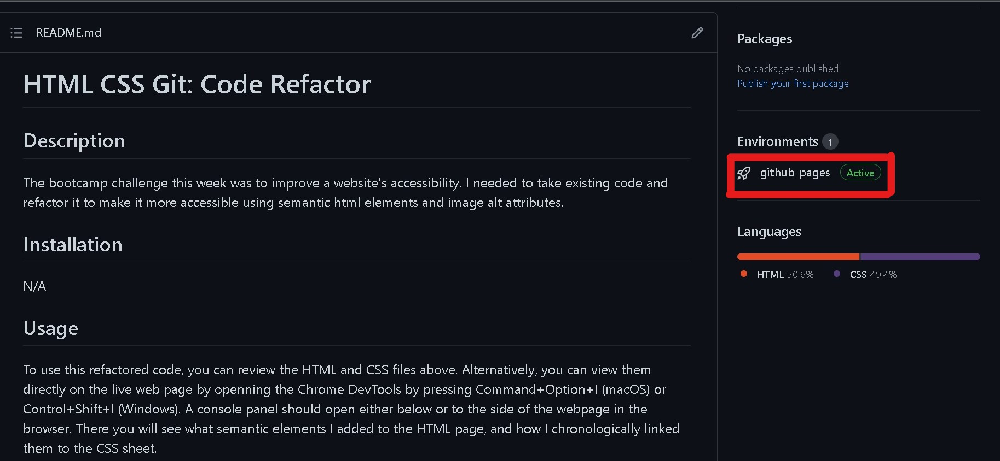
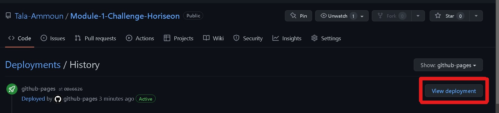

# HTML CSS Git: Code Refactor

## Description

The bootcamp challenge this week was to improve a website's accessibility. I needed to take existing code and refactor it to make it more accessible using semantic html elements and image alt attributes.

## Installation

N/A

## Usage

To use this refactored code, you can review the HTML and CSS files above. Alternatively, you can view them directly on the live web page by openning the Chrome DevTools by pressing Command+Option+I (macOS) or Control+Shift+I (Windows). A console panel should open either below or to the side of the webpage in the browser. There you will see what semantic elements I added to the HTML page, and how I chronologically linked them to the CSS sheet.

You can find the link to the deployed live webpage here: 

### Step 1:

### Step 2:

## Credits

N/A 

## License

Licensed under the MIT license.

